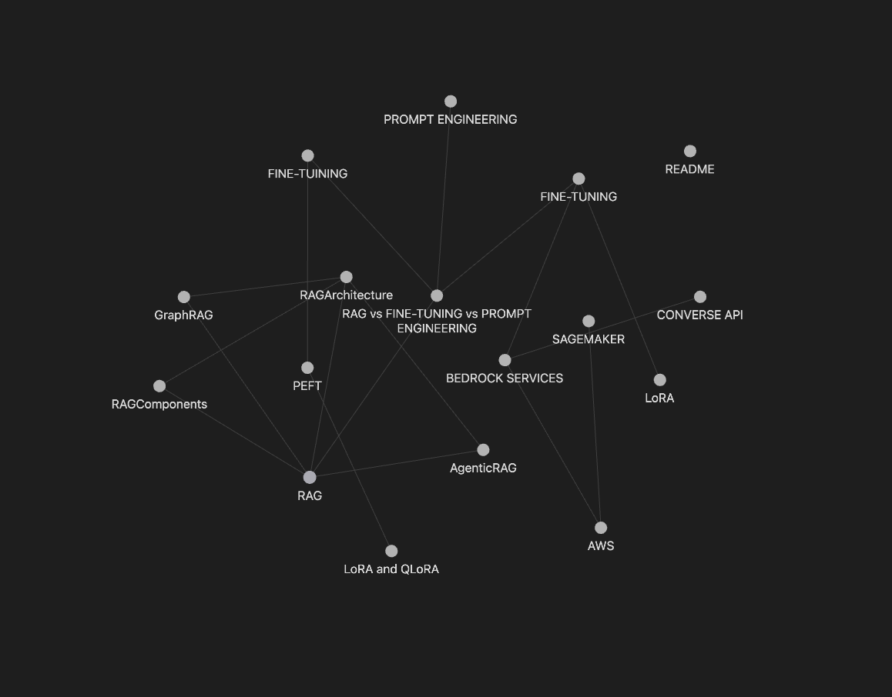

# AI Knowledge Graph

A personal knowledge base covering AI and Cloud concepts, built with Obsidian.

## Knowledge Graph

## Contents

### AI Concepts
- **RAG** — Retrieval-Augmented Generation
- **Agentic RAG** — RAG with autonomous agent workflows
- **GraphRAG** — Graph-based Retrieval-Augmented Generation
- **RAG Evals** — Evaluating RAG pipelines
- **Hybrid Retrieval** — Combining sparse and dense retrieval methods
- **Embeddings** — Vector embeddings and semantic representation
- **Vector Database** — Vector storage and similarity search
- **Knowledge Bases** — Knowledge base construction and management
- **Long Context** — Long context window techniques and trade-offs
- **Fine-Tuning** — Model fine-tuning techniques
- **PEFT** — Parameter-Efficient Fine-Tuning
- **LoRA** — Low-Rank Adaptation
- **LoRA & QLoRA** — Low-Rank Adaptation and Quantized LoRA
- **Prompt Engineering** — Prompting strategies
- **Chain of Thought (CoT)** — Step-by-step reasoning prompting strategy
- **ReAct** — Reasoning and Acting prompting framework
- **Prompt Chaining** — Sequential prompt workflows with gate checks
- **RAG vs Fine-Tuning vs Prompt Engineering vs Long Context** — Comparison guide
- **Model Parameters** — Key model parameters and their effects
- **Top K** — Top-K sampling for controlling output diversity
- **Top P** — Nucleus sampling for controlling output randomness
- **Temperature** — Temperature and its impact on model output
- **Models** — Overview of AI models and their capabilities
- **Prompt Evaluations** — Evaluating and scoring prompt quality
- **AI Agent** — Perception-reasoning-action loop and agent components
- **Agentic Design Patterns** — Core architectural patterns for agentic systems
- **Agent Development Kit (ADK)** — Google's code-first framework for building agents
- **LangChain** — Framework for building LLM-powered applications

### Cloud Concepts
- **AWS** — Amazon Web Services overview
- **Bedrock Services** — AWS Bedrock AI services
- **Amazon Bedrock Prompt Caching** — Prompt caching on AWS Bedrock
- **Bedrock Data Automation** — Automating data pipelines with Bedrock
- **Bedrock Fine-Tuning** — Fine-tuning models on AWS Bedrock
- **Bedrock Guardrails** — Safety and guardrails on AWS Bedrock
- **Converse API** — Bedrock Converse API
- **SageMaker** — AWS SageMaker
- **SageMaker Data Wrangler** — Data preparation and feature engineering
- **CloudWatch** — Monitoring and observability on AWS
- **Glue** — Serverless data integration and ETL on AWS
- **Amazon Transcribe** — Automatic speech recognition service on AWS
- **Amazon Polly** — Text-to-speech service on AWS
- **Amazon Comprehend** — Natural language processing service on AWS
- **Amazon OpenSearch** — Search and analytics service on AWS

### System Design
- **RAG Architecture** — End-to-end RAG system architecture
- **RAG Components** — Components, embedding, retrieval & re-ranking, pipeline algorithms
- **Model Parameters** — Temperature ranges and parameter visualizations
- **Prompt Evaluations** — Prompt evaluation diagrams
- **Chain of Thought (CoT)** — CoT prompting diagram

## Usage

Clone the repo and open in [Obsidian](https://obsidian.md) to explore the interactive knowledge graph with all linked concepts.
